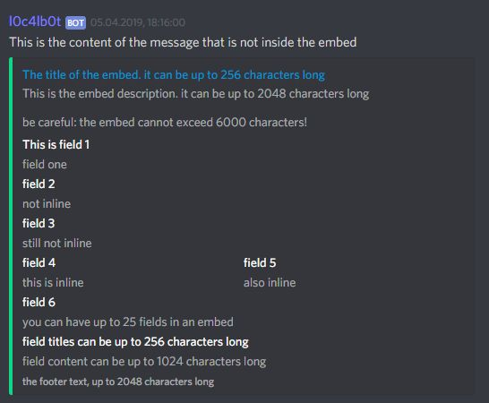

# How to use
Every command has to be in his own line. They cannot use more than one line. To use line breaks in arguments, please use `\n` instead of the line break.


# Events

- `onMessage` - fires when the bot receives a message
- `onJoin` - fires when a user joins the server
- `onLeave` - fires when a user leaves the server (or gets kicked)
- `onPin` - fires when a message gets pinned
- `onUnpin` - fires when a message gets unpinned
- `onBan` - fires when a user gets banned from the server
- `onPardon` - fires when the ban of a user gets removed
- `onNick` - fires when the nickname of a user changes
- `onVoiceJoin` - fires when a user joins a voice channel
- `onVoiceLeave` - fires when a user leaves a voice channel
- `onVoiceMove` - fires when a user moves between two voice channels
- `onReaction` - fires when a reaction is added to a message
- `onReactionRemoved` - fires when a reaction gets removed
- `onRoleAdded` - fires when a role is given to a user
- `onRoleRemoved` - fires when a role is taken from a user
- `onChannelCreated` - fires when a channel gets created
- `onChannelDeleted` - fires when a channel gets deleted
- `onCategoryCreated` - fires when a category gets created
- `onCategoryDeleted` - fires when a category gets deleted
- `onVoiceChannelCreated` - fires when a voice channel gets created
- `onVoiceChannelDeleted` - fires when a voice channel gets deleted
- `onRoleCreated` - fires when a role gets created
- `onRoleDeleted` - fires when a role gets deleted

# Functions

## General
#### sendMessage
##### Usage
```
sendMessage("channelId", "message")
```
##### Parameters
- `channelId` - the id of the channel the message should get send in
- `message` - the message (plain text) or a [JSON representation of the message](#json-messages) (embed)

##### Returns
- the id of the message that was sent

#### editMessage
##### Usage
```
editMessage("messageId", "message")
```
- `messageId` - the id of the message you want to edit
- `message` - the message (plain text) or a [JSON representation of the message](#json-messages) (embed)

#### deleteMessage
##### Usage
```
deleteMessage("messageId")
```
##### Parameters
- `messageId` - the id of the message you want to delete

#### sendDM

To prevent unwanted spam this function can only send DMs to users that are in your server at the time the function gets called.
##### Usage
```
sendDM("userId", "message")
```
##### Parameters
- `userId` - the id of the user you want to send the DM to
- `message` - the message (plain text) or a [JSON representation of the message](#json-messages) (embed)

#### giveRole
##### Usage
```
giveRole("userId", "roleId")
```
##### Parameters
- `userId` - the id of the user you want to add the role to
- `roleId` - the id of the role you want to add to the user

#### removeRole
##### Usage
```
removeRole("userId", "roleId")
```
##### Parameters
- `userId` - the id of the user you want to remove the role from
- `roleId` - the id of the role you want to remove from the user

#### setNickname
##### Usage
```
setNickname("userId", "nickname")
```
##### Parameters
- `userId` - the id of the user you want to change the nickname of
- `nickname` - the nickname you want the user to have (gets truncated to 32 characters)

##### Returns
- the new nickname (truncated)

#### resetNickname
##### Usage
```
resetNickname("userId")
```
##### Parameters
- `userId` - the id of the user you want to reset the nickname of

#### kickUser
##### Usage
```
kickUser("userId")
kickUser("userId", "reason")
```
##### Parameters
- `userId` - the id of the user you want to kick
- `reason` (optional) - the reason why you want to kick the user

#### banUser
##### Usage
```
banUser("userId")
banUser("userId", "reason")
```
##### Parameters
- `userId` - the id of the user you want to ban
- `reason` (optional) - the reason why you want to ban the user

#### clearReactions
##### Usage
```
clearReactions("messageId")
```
##### Parameters
- `messageId` - the id of the message you want to remove all reactions from

#### createRole

#### deleteRole

#### createTextChannel

#### createVoiceChannel

#### createCategory

#### deleteChannel

#### deleteCategory

#### moveChannel

#### joinVoiceChannel

#### leaveVoiceChannel

#### moveUser

#### clearQueue

#### playSong

#### enqueueSong

#### pauseSong

#### resumeSong

#### skipSong

#### match
##### Usage
```
match("toMatch", "regExp")
```
##### Parameters
- `toMatch` - the string you want to match
- `regExp` - the regular expression you want to match with
##### Returns
- wether the string matches the regular expression

This method does not only return a boolean, it also sets variables automatically. All captured groups get saved in the variable `groupX` where `X` is the number of the group. To access the third group you use `%group3%`. `group0` is the whole match. If a group has no value, the value gets set to an empty string.

### Return only

These are functionc that do nothing by their own. They only return a value you have to save, otherwise they are useless. If you don't know how to save the returned values, read [this part](#creating-your-own-variables)

#### equals

#### equalsIgnoreCase

#### startsWith

#### endsWith

#### contains

#### matches

#### mentions

#### hasAttachment

#### greaterThan
##### Usage
```
greaterThan("number1", "number2")
```
##### Parameters
- `number1` - the number that should be greater than `number2`
- `number2` - the number that should be less than `number1`
##### Returns
- wether `number1` is greater than `number2`

#### lessThan
##### Usage
```
lessThan("number1", "number2")
```
##### Parameters
- `number1` - the number that should be less than `number2`
- `number2` - the number that should be greater than `number1`
##### Returns
- wether `number1` is less than `number2`

#### levenshteinDistance
##### Usage
```
levenshteinDistance("argument1", "argument2")
```
##### Parameters
- `argument1`, `argument2` - the two string you want to compare
##### Returns
- the [levenshtein distance](https://en.wikipedia.org/wiki/Levenshtein_distance) of the two strings

#### upperCase
##### Usage
```
upperCase("text")
```
##### Parameters
- `text` - the text you want to get in upper case
##### Returns
- the text in upper case

#### lowerCase
##### Usage
```
lowerCase("text")
```
##### Parameters
- `text` - the text you want to get in lower case
##### Returns
- the text in lower case

#### length
##### Usage
```
length("text")
```
##### Parameters
- `text` - the text you want to know the length of
##### Returns
- the length of the string

#### calc
##### Usage
```
calc("term")
```
##### Parameters
- `term` - the term you want to calculate
##### Returns
- the result of the term

#### escapeRegex
##### Usage
```
escapeRegex("regExp")
```
##### Parameters
- `regExp` - the string you want to escape all regex
##### Returns
- the escaped string

#### replace
##### Usage
```
replace("text", "toReplace", "replaceWith")
```
##### Parameters
- `text` - the text you want to replace the text in
- `toReplace` - the text you want to get replaced
- `replaceWith` - the text you want to have instead
##### Returns
- the string with the text replaced

#### replaceFirst
##### Usage
```
replaceFirst("text", "regExp", "replaceWith")
```
##### Parameters
- `text` - the text you want to replace the text in
- `regExp` - the regular expression you want to get replaced
- `replaceWith` - the text you want to have instead
##### Returns
- the string with the first occurence of the regular expression replaced

#### replaceRegex
##### Usage
```
replaceRegex("text", "regExp", "replaceWith")
```
##### Parameters
- `text` - the text you want to replace the text in
- `regExp` - the regular expression you want to get replaced
- `replaceWith` - the text you want to have instead
##### Returns
- the string with all occurences of the regular expression replaced

### Logic

There are some functions that stop script execution and give you the possibility to only do something if a condition is true.<br>
They are called `continueIf<...>` and `breakIf<...>`. The `continueIf` function will continue script execution if the condition is true and stop it if the condition is false. `breakIf` on the other hand does the exact opposite of that. If the condition is true it will stop script execution and if the condition is false it continues.<br>
If you need something like a `if this then ..., otherwise ...` you need to use two scripts. One needs to have a `continueIf` and the other one a `breakIf` with the exact same arguments.

#### IfEqual
##### Usage
```
continueIfEqual("argument1", "argument2")
breakIfEqual("argument1", "argument2")
```
##### Parameters
- `argument1` - the value that should be equal to `argument2`
- `argument2` - the value that should be equal to `argument1`

#### IfStartsWith
##### Usage
```
continueIfStartsWith("toCheck", "startsWith")
breakIfStartsWith("toCheck", "startsWith")
```
##### Parameters
- `toCheck` - the value you want to check
- `startsWith` - the value `toCheck` has to start with

#### IfEndsWith
##### Usage
```
continueIfEndsWith("toCheck", "endsWith")
breakIfEndsWith("toCheck", "endsWith")
```
##### Parameters
- `toCheck` - the value you want to check
- `endsWith` - the value `toCheck` has to end with

#### IfContains
##### Usage
```
continueIfContains("toCheck", "contains")
breakIfContains("toCheck", "contains")
```
##### Parameters
- `toCheck` - the value you want to check
- `contains` - the value `toCheck` has to contain

#### IfMatches
##### Usage
```
continueIfMatches("toCheck", "regex")
breakIfMatches("toCheck", "regex")
```
##### Parameters
- `toCheck` - the value you want to check
- `regex` - the regular expression `toCheck` should match with

## Event specific

### Logic

#### IfMentions
##### Usage
```
continueIfMentions("messageId", "channelId")        CURRENTLY NOT AVAILABLE
breakIfMentions("messageId", "channelId")           CURRENTLY NOT AVAILABLE
continueIfMentions("messageId", "userId")
breakIfMentions("messageId", "userId")
continueIfMentions("messageId", "roleId")
breakIfMentions("messageId", "roleId")
```
##### Parameters
- `messageId` - the id of the message you want to check (CURRENTLY NOT AVAILABLE)
- `channelId` - the id of the channel you want to check for
- `userId` - the id of the user you want to check for
- `roleId` - the id of the role you want to check for (to check for `@everyone` and `@here` use `everyone`, Discord does not differentiate between those two)

##### Supported events
- onMessage

#### IfUserHasRole
##### Usage
```
continueIfUserHasRole("userId", "roleId")
breakIfUserHasRole("userId", "roleId")
```
##### Parameters
- `userId` - the user you want to check
- `roleId` - the role you want to check the user for

#### IfUserIsInVoiceChannel

# Variables

| Variable | Description | Functions supporting the variable |
| - | - | - |
| `%guildid%` | The id of the guild | all |
| `%guildname%` | The name of the guild | all |
| `%guildicon%` | The icon of the guild | all |
| `%userid%` | The id of the user triggering the event | onMessage |
| `%username%` | The name of the user | onMessage |
| `%usernick%` | The nickname of the user (or username if not nicked) | onMessage |
| `%userpfp%` | The profile picture of the user | onMessage |
| `%userdiscriminator%` | The discriminator of the user | onMessage |
| `%usermention%` | The mention of the user | onMessage |
| `%channelid%` | The id of the channel | onMessage |
| `%channelname%` | The name of the channel | onMessage |
| `%channeltopic%` | The topic of the channel | onMessage |
| `%channelmention%` | The mention of the channel | onMessage |
| `%messageid%` | The id of the message | onMessage |
| `%messageurl%` | The direct URL to the message | onMessage |
| `%content%` | The content of the message | onMessage |
| `%formattedcontent%` | The content of the message with human-readable mentions | onMessage |

## Creating your own variables

You can define your own variables. All [functions](#functions) that have a `Returns` title return the value explained there. To save this value in a variable, use `variable = function("argument")`. To access that variable afterwards, use `%variable%`.
You CAN'T use functions that have a return value inside of other functions. Scripts like `sendMessage("1234567890", "%sendMessage("1234567890", "something")%")` will not work!

### Example
```
messageId = sendMessage("1234567890", "This is some message")
sendMessage("1234567890", "I just sent a message with the id %messageId%")

c=createTextChannel("channelname")
sendMessage("%c%", "I just created this channel")

vc = createVoiceChannel("some voice channel")
joinVoiceChannel("%vc%")
clearQueue()
playSong("despacito")

role = createRole("rolename")
giveRole("1234567890", "%role%")
```

# JSON Messages
If you want to use embeds in messages you need to use the bot's syntax for them. Because every command can only take one line of code, the JSON has to be in a non-readable form.<br>
I recommend using the readable form and a JSON validator to make sure everything is correct and then removing all line breaks.<br>
I recommend using single quotes (`'`) for the JSON, because double quotes can cause trouble with function parsing, causing arguments to be interpreted wrong and the function to not work, even though JSON standards require double quotes and I try my best to avoid the problem.

### Keys
- `content` - the content of the message (plain text, no inside the embed)
- `title` - the title of the embed
- `description` - the description of the embed
- `color` - the color of the embed (can be `#f0f`, `#ff00ff`, `16711935` or `magenta`)
- `author` - the author name of the embed
- `authorIcon` - the author icon URL of the embed
- `authorUrl` - the author URL of the embed
- `footer` - the footer text of the embed
- `footerIcon` - the footer icon URL of the embed
- `image` - the image URL of the embed
- `thumbnail` - the thumbnail URL of the embed
- `url` - the URL of the embed title (requires `title`)
- `fields` - the array of [fields](#fields) in the embed

## Fields
### Keys
- `title` - the title of the field
- `content` - the content of the field
- `inline` - wether the field should be inline or not (`false` if not set)

## Example
#### Human-readable form
```json
{
    "content": "This is the content of the message that is not inside the embed",
    "title": "The title of the embed. it can be up to 256 characters long",
    "description": "This is the embed description. it can be up to 2048 characters long\n\nbe careful: the embed cannot exceed 6000 characters!",
    "color": "1234567",
    "url": "https://example.com/",
    "fields": [
        {
            "name": "This is field 1",
            "content": "field one"
        },
        {
            "name": "field 2",
            "content": "not inline"
        },
        {
            "name": "field 3",
            "content": "still not inline",
            "inline": false
        },
        {
            "name": "field 4",
            "content": "this is inline",
            "inline": true
        },
        {
            "name": "field 5",
            "content": "also inline",
            "inline": true
        },
        {
            "name": "field 6",
            "content": "you can have up to 25 fields in an embed",
            "inline": true
        },
        {
            "name": "field names can be up to 256 characters long",
            "content": "field content can be up to 1024 characters long"
        }
    ],
    "footer": "the footer text, up to 2048 characters long",
    "author": "the auuthor's name, up to 256 characters long"
}
```

#### One-line form to use it in the bot
```json
{"content":"This is the content of the message that is not inside the embed","title":"The title of the embed. it can be up to 256 characters long","description":"This is the embed description. it can be up to 2048 characters long\n\nbe careful: the embed cannot exceed 6000 characters!","color":"1234567","url":"https://example.com/","fields":[{"name":"This is field 1","content":"field one"},{"name":"field 2","content":"not inline"},{"name":"field 3","content":"still not inline","inline":false},{"name":"field 4","content":"this is inline","inline":true},{"name":"field 5","content":"also inline","inline":true},{"name":"field 6","content":"you can have up to 25 fields in an embed","inline":true},{"name":"field names can be up to 256 characters long","content":"field content can be up to 1024 characters long"}],"footer":"the footer text, up to 2048 characters long","author":"the auuthor's name, up to 256 characters long"}
```
#### Preview


# Example scripts
## onMessage
Delete messages that mention everyone and ban the user who wrote the message
```
continueIfMentions("%messageid%", "everyone")
banUser("%userid%", "Mentioned @everyone")
deleteMessage("%messageid%")
```
Give the user a role if he writes `-verify` in the verify channel (`1234567890` is the id of the role the user should get)
```
continueIfEqual("%content%", "-verify")
continueIfEqual("%channelname%", "verify")
giveRole("%userid%", "1234567890")
```

## onJoin
Add `New - ` to the name of a joining user and give a role (`1234567890` is the id of the role the user should get)
```
setNickname("%userid%", "New - %username%")
giveRole("%userid%", "1234567890")
```
Kick your friend when he joins
```
continueIfEqual("%userid%", "1234567890")
kickUser("%userid%", "This is fun!")
```
Have a nice welcome message for your users
```
sendMessage("1234567890", "{"color":1234567, "title":"A new fighter", "description":"Hey everyone!\n%username% joined this server. Be nice to him!", "author":"%username%#%userdiscriminator%", "authorIcon":"%userpfp%"}")
```